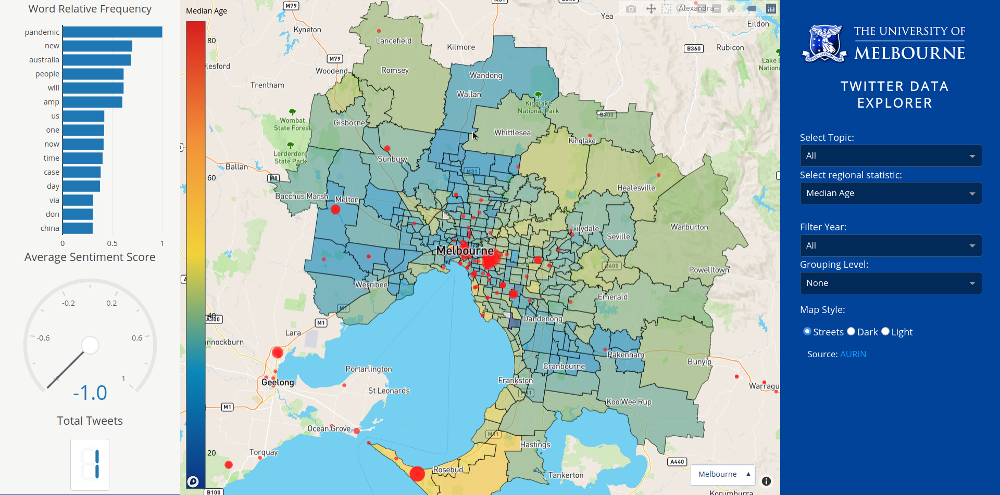

## Dash Web App 

You can see live version of this app on nectar at http://172.26.134.45/ *(as long as the instance hasn't been removed)*

To run this app locally, first clone repository and then open a terminal to the flask folder.

Create and activate a new virtual environment (recommended) by running
the following:
*
On Windows

```
virtualenv venv 
\venv\scripts\activate
```

Or if using linux

```bash
python3 -m venv myvenv
source myvenv/bin/activate
```

Install the requirements:

```
pip install -r requirements.txt
```
Run the app:

```
export FLASK_APP=run.py
export FLASK_ENV=development
flask run
```
You can run the app on your browser at http://127.0.0.1:5000

To run the container locally:

```sh
docker-compose up --build
```

Go to - http://127.0.0.1/

## Screenshot




## Resources

To learn more about Dash, please visit [documentation](https://plot.ly/dash).
